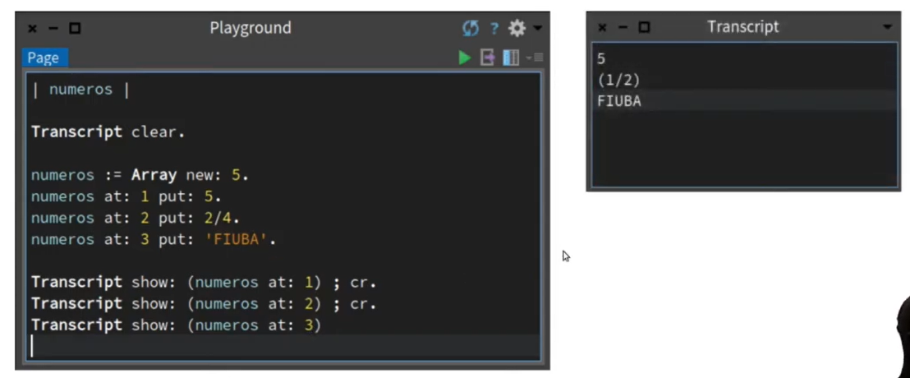
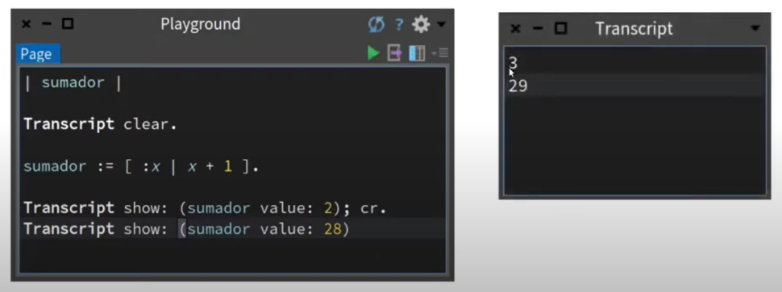
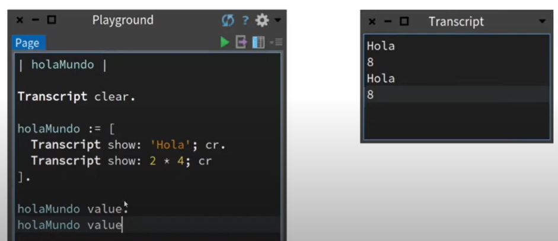

INICIO: 
Transcript show:'hola mundo'. 

ESTRUCTURAS:  
Variables: | variable1 varibale2 | => variables locales entre plecas.  
Sentencias: terminan con punto.  
Comentarios: entre comillas ''. 
Asignacion: :=  
Comparacion: =  

A SABER:
Transcript clear. => limpia a ventana. 
; => envia otro mesaje al mismo receptor. 
cr => linea aparte. 
Corchetes= representan objeto especial=> block, clausura o mtoos anonimos. 
-Encierra una o mas sentencias de codigo. 
-Puede reciir o no parametros. 

PSEUDOVARIALES: 
true 
false 
self (ref al objeto en el que me encuntro) 
super (ref al objeto padre) 
nil 
thisContext 

Ordered Collection: 

 
ARRAY 

 
BLOQUES 

 

CLASES:  
|persona| 
persona := Persoona new. 
persona nombre: 'Tomas'. 
persona apellido: 'Orsi'. 
Transcript clear. 
Transcript show:  persona nombreCompleto 

Para guardar clase: 
DO IT =>aparece error.